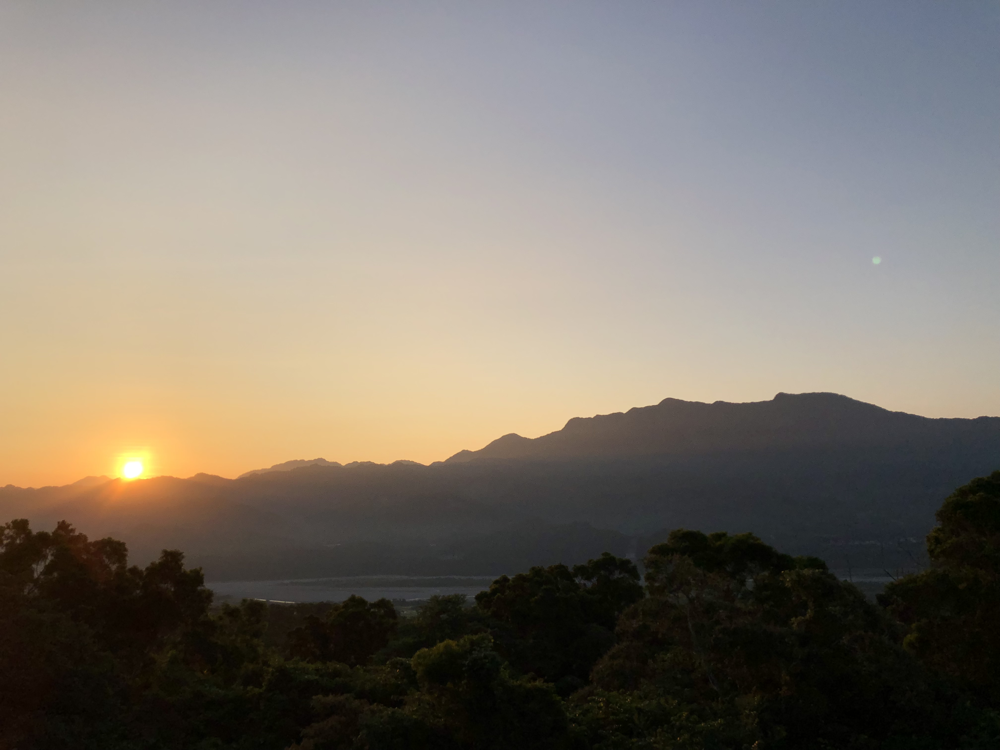
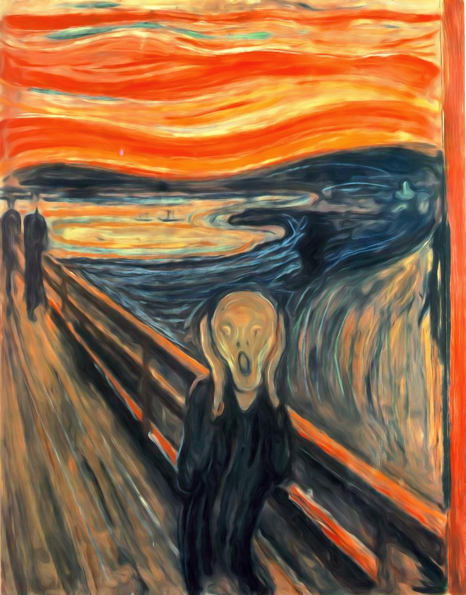
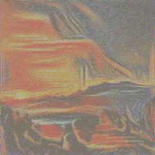
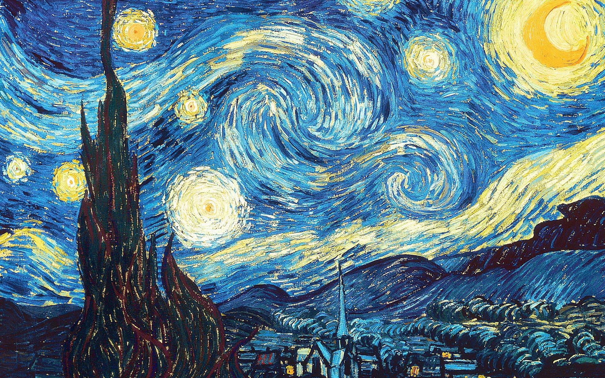
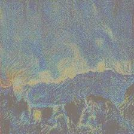

# Neural style transfer

## Overview
In this project, I wanted to learn more about neural style transfer. After reading Gatys et. al's [paper](https://arxiv.org/abs/1508.06576), I decided to reproduce their results by building it using the PyTorch framework.

While working on it, I divided it into multiple steps: from preprocessing the image all the way to performing a neural style transfer to a white noise image.

Here are some example results:

### 1) Content image

### 2a) Style image

### Result:

### 2b) Style image

### Result:

## How to run
This contains a Jupyter notebook. One can add their own image and changing the `CONTENT_IMG2_PATH` with the location of the new image. The balance between content and style can be fine-tuned by changing the `ALPHA` and `BETA` values, respectively. I found that `ALPHA = 50` and `BETA = 1e6` worked best.

## Credits
Firstly, thank you to the [original paper](https://arxiv.org/abs/1508.06576) for providing the necessary theory behind neural style transfer. 

Secondly, thank you to [fast.ai](https://github.com/fastai/fastai) as I used as a resource on how to use forward hooks to capture the activations for any model's layers. This helped me approach the problem differently. 

Finally, the official PyTorch [neural style transfer tutorial](https://pytorch.org/tutorials/advanced/neural_style_tutorial.html) for all the small things to keep an eye out for when implementing this project.
